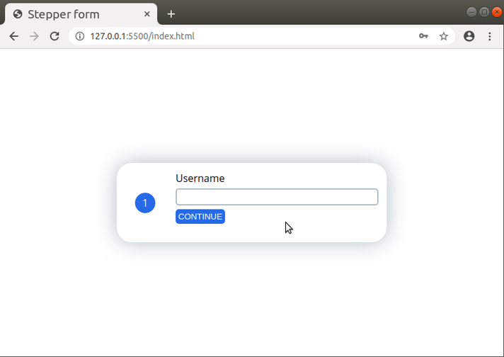

# Stepper Form

This is a simple form that is filled one step at a time by the user. Tt was built with HTML, CSS and Javascript for [a coding challange proposed by Colt Steele](https://www.youtube.com/watch?v=qGwR_DSSnuQ). Check it out: https://estevaocostag3.github.io/stepper-form/.

